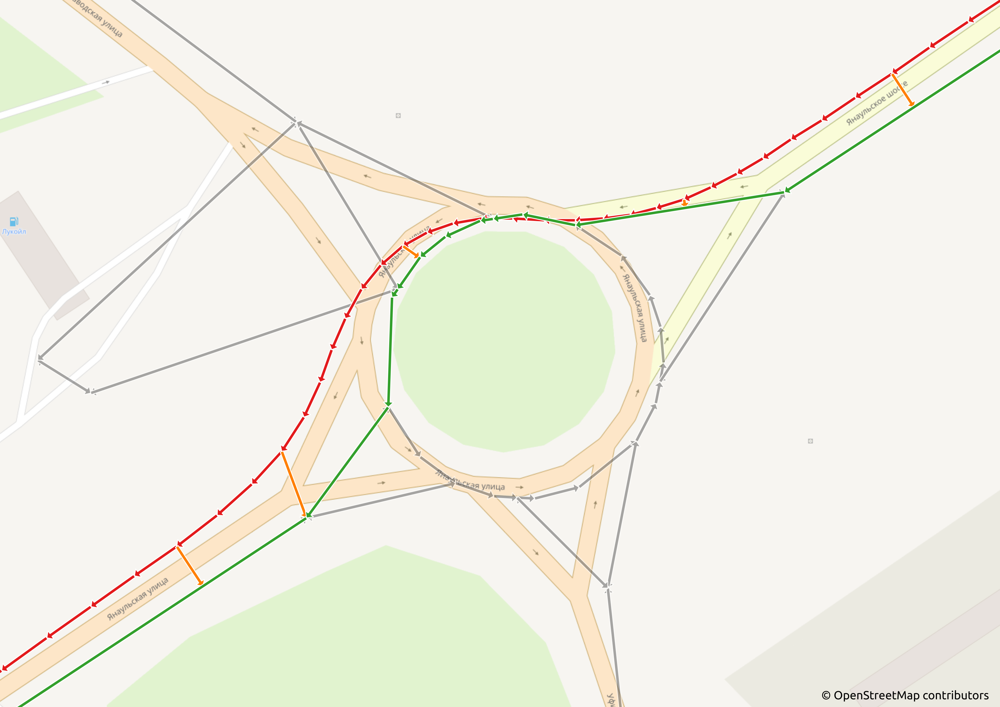
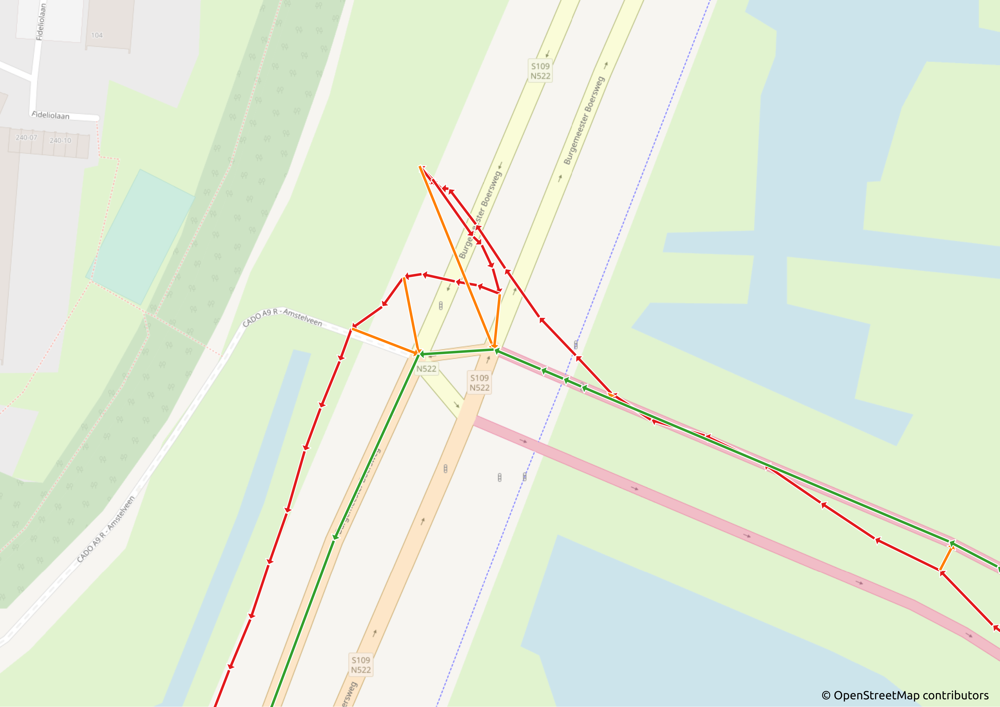
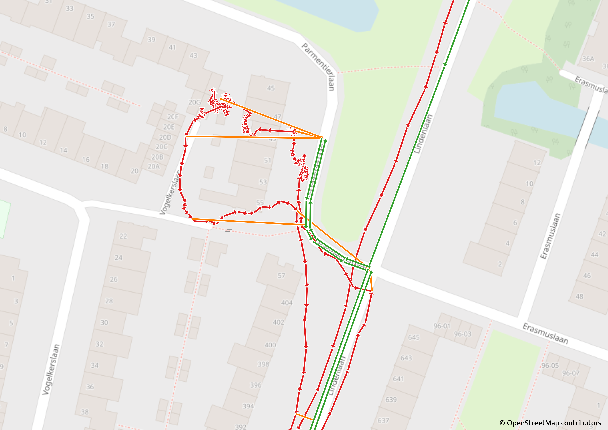
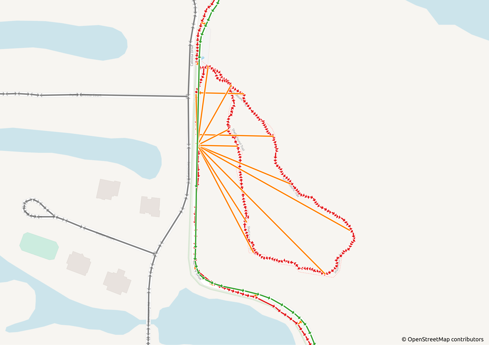
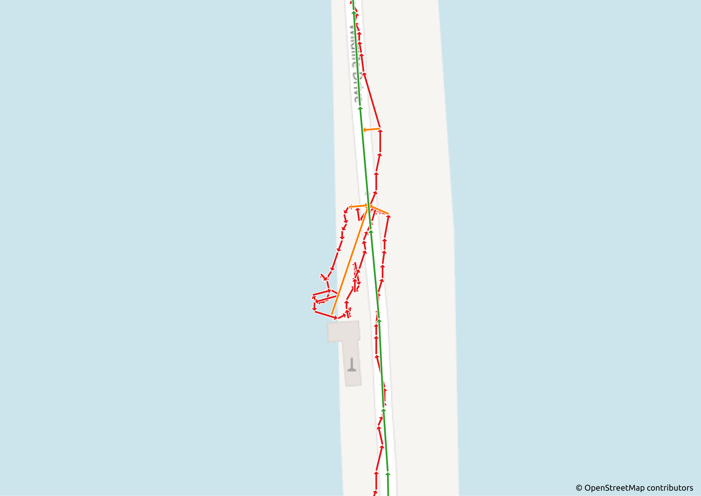
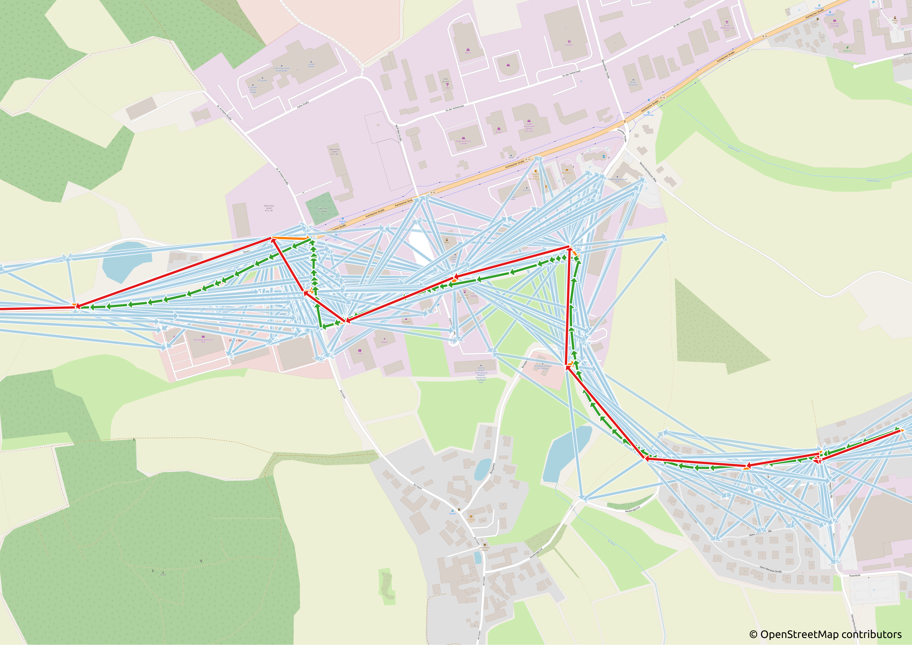
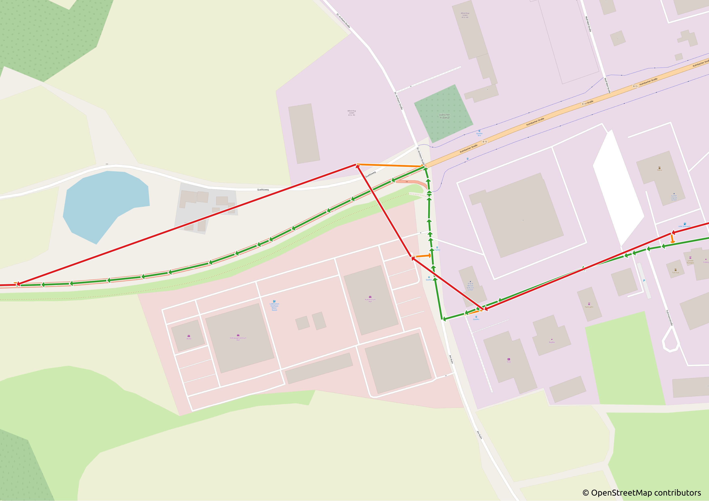
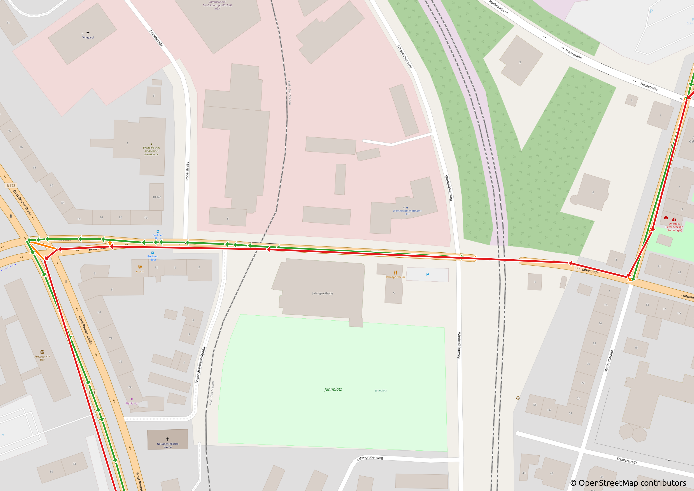
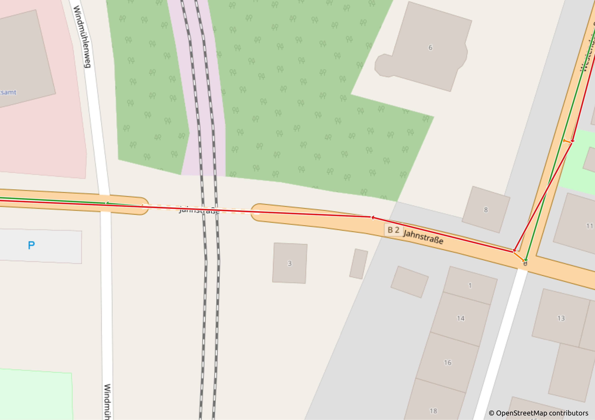

# Map Matching 2 [Work-in-progress]

**Map Matching based on Markov Decision Processes (MDPs) and Hidden Markov Models (HMMs).**

Currently the following models are implemented:

* Markov Decision Process (MDP) for single tracks.
* Hidden Markov Model (HMM) for single tracks.

Currently the following algorithms are implemented:

* for Hidden Markov Models
    * Viterbi algorithm
* for Markov Decision Processes
    * Policy Iteration
    * Value Iteration
    * Q-learning

Various advanced map matching algorithms are implemented, for example:

* OpenStreetMap `.osm.pbf` import of road network
* Tags for car-network currently implemented, other network types such as bycicles, walking, railroads will come in
  future updates, maybe also individual tag specifications
* `.csv` import of tracks, either as list of points or WKT lines or multilines
* `.gpx` import of tracks (from TRK records, multiple segments per track are supported)
* Multiple input files supported by specifying multiple track files, for example multiple `.gpx` files
* Import in shell pipeline mode of WKT lines or multilines (optional)
* Native import and matching of the map matching dataset
  at [Dataset for testing and training map-matching methods](https://zenodo.org/record/57731) (optional)
* Export of imported map data in various processing stages for easy view in [QGIS](https://www.qgis.org/)
* Export of processed map data in `.osm.pbf` format for faster reimport or usage of same map data in third-party tools
  (optional)
* Export of processed map data as native binary data file for about ten times faster reimport compared to
  using `.osm.pbf`  file again, depends on the speed of the underlying storage, SSD or NVMe recommended, also the binary
  files are about five to ten times larger than the `.osm.pbf` file (optional)
* Comparison methods for matching results of own results and results of external software (optional)
* Lossless Network simplification for reducing nodes and edges
* Baking of imported modifiable graph (as lists) to a static graph (as vectors) for faster traversal with Dijkstra
  algorithm
* Reprojections between geographical and cartesian spatial reference systems (SRSs) and matching in both SRSs (optional)
* Upper bound Dijkstra algorithm for routing
* Early stopping Dijkstra algorithm when finding all goals (we tried A-Star algorithm but removed it because A-Star only
  works between two points, Dijkstra works between a single source and many targets, which is better for map matching
  between one candidate and all next possible candidates)
* Fat initialized segments and lines for edges (e.g., network edges, candidate edges)
* Removing of weakly unconnected subgraphs (optional)
* Caches for length and bearing calculations
* Caches for routes from single-source Dijkstra algorithm
* Track sanitation with Douglas-Peucker algorithm
* Removing of spatially duplicate points
* Median merging of point clouds, with adaptive distance when the next road is far away
* Candidate search based on adaptive circle radius or k-nearest neighbor
* Candidate adoption of siblings and/or nearby candidates
* Matching of tracks with gaps with MDP and skip-errors option (default)
* Tunable weights for HMM and MDP models
* Index mapping for MDP model and algorithms for rewards, V and Q tables (so rewards are also cached)
* In-Place versions of Value Iteration and Policy Iteration with beneficial ordering of the states for very quick
  convergence
* Tunable parameters for all algorithms, such as learning rate, discount factor, epsilon, etc.
* Output to `.csv` file for easy view in [QGIS](https://www.qgis.org/) or optional console for shell pipeline mode
* Quiet mode and verbose mode with benchmark timings (optional)
* Multi-threading which can optionally be disabled
* Improved memory management with [rpmalloc](https://github.com/mjansson/rpmalloc)
* *More features are in the making ...*

The provided source code is heavily tuned and optimized for fast and accurate map matching. \
Please read the
paper [Evolving map matching with markov decision processes](https://opus4.kobv.de/opus4-hof/frontdoor/index/index/docId/119)
for more information about this open source tool. \
We are currently working on several new research papers based on this approach.

Pull from Docker Hub: \
`docker pull addy90/map-matching-2`

Or build docker image: \
`docker build -t map-matching-2 .`

Run docker container: \
`docker run --rm -it -v $(pwd)/data:/app/data -u $(id -u ${USER}):$(id -g ${USER}) --name map-matching-2 map-matching-2`

Place input files in current data directory `$(pwd)/data` that you created beforehand. \
Within the Docker container, the directory is mounted under `/app/data`. \
Results that you output to `/app/data` will become available under your user in `$(pwd)/data`.

View Map Matching Help (or view [help.txt](help.txt)): \
`./map_matching_2 --help`

Example (be aware, uses as much CPU cores as available, even scales with 128 cores, and in this example needs at least
64 GB of available system memory):

```
./map_matching_2 \
  --network "/app/data/oberfranken-latest.osm.pbf" \
  --tracks "/app/data/points_anonymized.csv" \
  --delimiter ";" \
  --id "device" --id "subid" \
  --x "lon" --y "lat" \
  --time "timestamp" --time-format "%F %T%Oz" \
  --output "/app/data/matches.csv" \
  --verbose
```

If you don't have that much RAM, disable candidate adoption with \
`--candidate-adoption-siblings off --candidate-adoption-nearby off` \
but be aware that this reduces the map matching accuracy drastically. \
Works with about 16 GB of available system memory then, maybe less, depending on the amount of CPU cores available.

If you don't want to use multi-threading for map matching enable \
`--single-threading`. \
This also reduces global memory usage as parallel matching does not occur.

### Build

If you want to build the software yourself, consult the `Dockerfile` for instructions. \
You need a recent and up-to-date Linux, for example Ubuntu 20.04 LTS.

Install the following prerequisites:

```
sudo apt-get install -y build-essential cmake git
sudo apt-get install -y zlib1g-dev libbz2-dev libexpat1-dev libproj-dev
```

You can build the software with the following commands:

```
cmake -DCMAKE_BUILD_TYPE=Release -B build
cmake --build build --parallel $(nproc) --target install
```

Then the built software can be found in the newly created `run/bin` directory.

For building under Windows you need Ubuntu 20.04 LTS for the Windows Subsystem for Linux (WSL). Building is the same as
under Linux then. Native build currently is unsupported due to several dependencies not building natively under Windows.

### Examples

Exporting the network graph as binary file for (approximately ten times) faster reimport:

```
./map_matching_2 \
  --network "/app/data/oberfranken-latest.osm.pbf" \
  --network-save "/app/data/oberfranken-latest.dat" \
  --verbose
```

Using exported network graph instead of original input file, simply replace `--network` with `--network-load` and the
previously exported file from `--network-save` (see above):

```
./map_matching_2 \
  --network-load "/app/data/oberfranken-latest.dat" \
  [... remaining options ...]
  --verbose
```

Using `.gpx` files is as simple as `.csv` files. As the GPX scheme is well-defined, no additional configuration is
needed, see here an example with multiple `.gpx` files and previously exported network:

```
./map_matching_2 \
  --network-load "/app/data/oberfranken-latest.dat" \
  --tracks "/app/data/record_1.gpx" \
  --tracks "/app/data/record_2.gpx" \
  --tracks "/app/data/record_3.gpx" \
  --output "/app/data/matches.csv" \
  --verbose
```

This tool has native support for the [map matching dataset](https://doi.org/10.5281/zenodo.57731) from Kubicka, M. et
al.

For example, for matching and comparing the first track from the data set with the provided hand corrected result track,
extract the zip file and use the following command:

```
./map_matching_2 \
  --nodes "/app/data/map-matching-dataset/00000000/00000000.nodes" \
  --arcs "/app/data/map-matching-dataset/00000000/00000000.arcs" \
  --tracks "/app/data/map-matching-dataset/00000000/00000000.track" \
  --no-header --no-id --delimiter $'\t' --x 0 --y 1 --time 2 --no-parse-time \
  --compare "/app/data/map-matching-dataset/00000000/00000000.route" \
  --compare-edges-list-mode \
  --output "/app/data/map-matching-dataset/00000000/00000000.result.csv" \
  --compare-output "/app/data/map-matching-dataset/00000000/00000000.compared.csv" \
  --model value-iteration \
  --verbose
```

The `*.result.csv` contains the id, matching duration, original track as WKT, the prepared track after Douglas-Peucker
and median merge simplification steps as WKT, and the matched result as WKT. You can load the results into QGIS. If you
want to see the network, use `--export-simplified-network nodes.csv --export-simplified-network edges.csv` arguments. If
you want to see the candidates, use `--export-candidates "existing-folder"` which exports the candidates and the
policy (the chosen candidates) in seperate files into the given folder. If you want to use a different model, consult
the `--help`, for example `--model viterbi` uses HMMs with Viterbi algorithm.

The `*.compared.csv` file contains again the id, track, prepared and result WKT strings the result file also contains
and additionally the ground truth track that the matched track was compared against. Moreover, the exact error
fraction (see paper for formula), added and missed lengths as well as WKT lines are provided for easy view in QGIS. Use
import of delimited text file for importing the WKT lines from the resulting csv files.

The following five examples come from the [map matching dataset](https://doi.org/10.5281/zenodo.57731) from Kubicka, M.
et al. All following examples were matched with our Markov Decision Process with Value Iteration and default parameter
settings, see `help.txt` or `./map_matching_2 --help`.

#### Example 1


The original track is in red, the candidate policy projections are in orange, the matched result is in green and in gray
are the provided edges from the arcs-nodes network. You can see that there are fewer candidate projections than the
track has points (between each arrow there are two points). This comes from the track sanitation as unnecessary points
are removed before matching. In this example, the green match is perfectly matched in the circle concerning the
underlying road network in gray because it is slightly off the OpenStreetMap background image.

#### Example 2


In this example a noise in the red track was correctly removed when taking a turn to the left. The noise might have come
from GPS measurement errors but clearly the red track does not exactly behave as expected at such a T-junction. With our
candidate-adoption approach, the algorithm was able to match multiple adjacent candidates to the same network edges,
which removed the noisy part in the green matched result.

#### Example 3


Here the red track that comes from the north first goes to the south, then comes back later and then goes around a
residential district. It looks like the driver went off the car, walked around and later returned to the car. Though
this situation created very many GPS measurements and noise, our algorithm found a well fitting solution to this
situation on the underlying road network in the green matched result without any large detours. Median merge for the
point clouds as well as candidate adoption were key points for this solution.

#### Example 4


In this extreme case, a detour around a park was made where no road network was provided in the underlying data. Our
nearby candidate adoption feature allowed the detour to project onto the same road position, so again no driving around
the noisy situation happened. The given road network did not allow the detour, as it can be seen that no gray lines lie
aside of the red track in the park area. Our algorithm was able to remove the detour from the match so that it fits well
to the provided road network.

#### Example 5


Another example of a noisy part in the original red track that was completely removed by our track sanitation and
candidate adoption features that allowed our stochastic MDP process to find an overall optimal solution concerning its
defined metrics. The green match goes straight through without turning around multiple times in the high error
situation.

The following five examples come from the `points_anonymized.csv` matched with `oberfranken-latest.osm.pbf` as described
above in this readme.

#### Example 6


Here is an example of the original candidates in light blue that our algorithm chose from. The chosen candidates are in
orange. We can see how the candidate adoption feature works, each road position is mapped to multiple track positions.
This enables the stochastic process to eliminate noisy parts as shown in the examples above by mapping multiple GPS
positions to the same road candidate positions. In this example however there was no such noise.

#### Example 7


This is the same example as above but with the light blue candidates removed, only the orange selection remains. We can
see that the red track is not always matched to the nearest road edge position but to the position that fits best
concerning the metrics. In our paper, we describe this as typical road behavior. Currently our definition of typical
road behavior already leads to fine results as we can see in the benchmarks in our paper. Still there is room for
improvement, as usually with stochastic methods. In this case, we can all agree that the green matched result is
perfectly representing the red track.

#### Example 8


This is the same example as above, just zoomed in to the positions where not the nearest road edge candidate was chosen
but the ones that fit best in the overall result. We can see that the chosen candidate depends on the overall best
route. If we only had chosen the best candidates for the track part that goes north (so only a local optimum), we might
have ended up in the road directly north to the green match. As the later position is clearly on the orange road, the
combination of the selected road positions is globally best in this way (global optimum).

#### Example 9


Here is an example of a gap in the result. Not the track has the gap but the result was automatically split in the
Markov Decision Process. The track was recorded at a time when the bridge over the railways was open. The current
OpenStreetMap data has the bridge closed, so the track as seen is currently not possible to drive. We know this is true
because this is our hometown. Our algorithm (Value Iteration) decided not to route around the impossible situation but
to split the matching result at the closed bridge. Overall, this leads to a smaller error than driving around this
location far away, which people have to do in reality currently. For the old track this match is definitely fine, though
not perfect. Our implementation of the Viterbi algorithm with Hidden Markov Models does not allow this dynamic split to
happen because the Hidden Markov Model is a static model precomputed before the Viterbi algorithm solves it. The Markov
Decision Process however allows for dynamic action selection during the optimization, this is why it can decide to
introduce a gap (which means that it leads to new states at optimization time which the Viterbi algorithm cannot do)
when it notices that large detours are needed in a specific situation. It should be possible to detect and precompute
such situations for Hidden Markov Models as well but as our Markov Decision Process intrinsically enables such dynamic
solutions as we described, we did not implement it in our Hidden Markov Model.

#### Example 10


This is the same example as above but the closed bridge is zoomed in. We can see that the green match result was split a
bit earlier than only around the closed part of the bridge. This is a result that can be discussed. We can see that the
orange candidate policy projections lie in a difficult situation. With the measurement points (at the red track arrows)
it is definitely difficult to choose optimal candidates in this situation. Though this result is not perfect, it is
quite good compared to a result that would make a large detour in this situation.

Of course the examples only show a fraction of what our open source software is able to do. More research in situations
that don't work this well already is going on. Please also review the paper for more extensive benchmarks, comparisons,
and explanations.

### References

*This is the successor to the deprecated repository [Map Matching](https://github.com/iisys-hof/map-matching).*

If you want to cite this work, please feel free to adapt the following Bibtex for your needs:

```
@article{Woeltche-2021-Evolvingmapmatchin,
  title     = {{E}volving map matching with markov decision processes},
  author    = {{W}öltche, {A}drian},
  year      = {2021},
  month     = {10},
  publisher = {{H}of {U}niversity},
  url       = {https://opus4.kobv.de/opus4-hof/frontdoor/index/index/docId/119},
  keywords  = {map matching, geospatial information science, hidden markov model, markov decision process}
}
```
