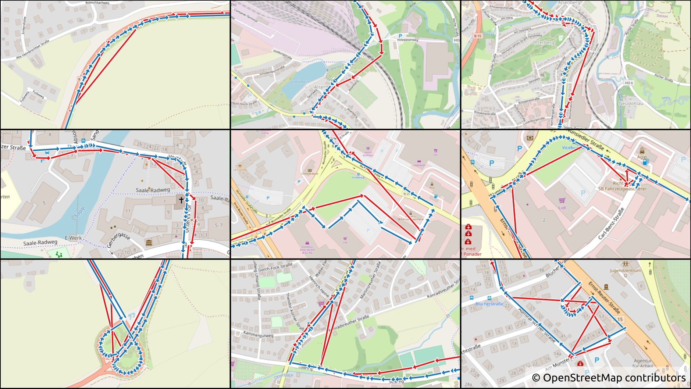
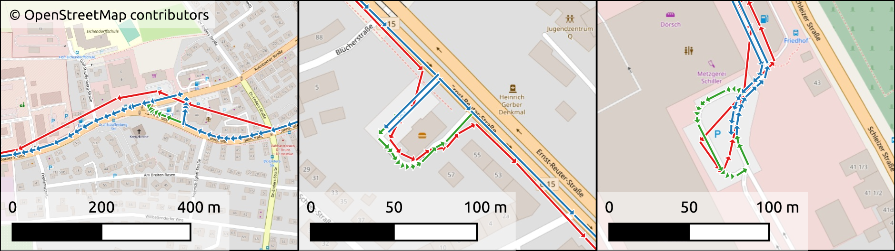

# Map Matching 2

## High Performance Map Matching with Markov Decision Processes (MDPs) and Hidden Markov Models (HMMs)

:page_facing_up: Please read the official article for more information about this open source software: \
**Open source map matching with Markov decision processes: A new method and a detailed benchmark with existing
approaches** (https://doi.org/10.1111/tgis.13107)

:exclamation: **TL;DR:** This software can match GPS tracks to OpenStreetMap road networks comparably accurate and
rapid.

### Table of Contents

- [Description](#description)
- [Download](#download)
- [Example](#example)
- [Features](#features)
- [Usage](#usage)
- [Building](#building)
- [Benchmarks](#benchmarks)
- [Reference](#reference)

### Description

By applying stochastic models, this software evaluates a huge number of alternating paths between all points of a GPS
track for finding the best representation of the given track overlapping exactly with the given road network.
"Best" in terms of the optimal solution concerning the defined models and metrics.
In other words, with this software, you can match recorded GPS tracks to the roads of the existing street network.
For example, when you record driving from A to B and the recorded track is not exactly lying on the roads or there are
outliers, this software resolves the differences between the record and the roads.

The methods in this software are described and benchmarked in more detail in the official article:\
**Open source map matching with Markov decision processes: A new method and a detailed benchmark with existing
approaches** (https://doi.org/10.1111/tgis.13107)

### Download

Our software can be downloaded prebuilt for Windows and Linux on the release page:

### [Download Latest Release](https://github.com/iisys-hof/map-matching-2/releases/latest)

**Windows**: Zip-File containing the portable binary `map_matching_2.exe`.\
**Linux**: portable AppImage containing the binary `map_matching_2` and the necessary shared libraries.\
Remember to make the AppImage executable (`chmod +x` or right click, settings, make executable).\

The AppImage uses a new runtime and should no longer need `libfuse2` or `fuse3` but in case you get any warnings or
errors on executing the AppImage, try to install these packages or use the `--appimage-extract-and-run` argument.

Both variants also contain the license information of the used third-party libraries in the `doc` folder.\
For extracting the AppImage, use on the AppImage binary `--appimage-extract`.

We also provide a Docker container, adjust the paths as necessary:\
`docker run --rm -v $(pwd)/data:/app/data -u $(id -u ${USER}):$(id -g ${USER}) addy90/map-matching-2`

Arguments can be appended directly, for example:\
`docker run --rm -v $(pwd)/data:/app/data -u $(id -u ${USER}):$(id -g ${USER}) addy90/map-matching-2 --help`

### Example


This is Figure 12 from the mentioned article (https://doi.org/10.1111/tgis.13107).

It shows nine difficult to match track situations (in <span style="color:#e31a1c">red</span>) with the results
(in <span style="color:#1f78b4">blue</span>) from this software.
In the background is the OpenStreetMap network image.
The tracks are from the Floating Car Data (FCD) set that is available in this repository.

"From left to right, top to bottom, we have: (1) large outlier; (2) shift to east; (3) unclear track shape with shift
and noise; (4) shift, noise, and outlier; (5) unclear track shape with cross-movement; (6) unclear track shape with
U-turn and cross movement; (7) sparse cross movement; (8) large outlier; and (9) shifted track part with a large
outlier."
(Citation from Figure 12 subtitle in: https://doi.org/10.1111/tgis.13107)

This example shows that our Map Matching 2 software is capable of matching tracks with challenging and uncertain geo
positions recorded.
The matches (in <span style="color:#1f78b4">blue</span>) look correct to the human eye in these situations.
Or at least, a human could probably not create a better result in these situations.


This is Figure 13 from the article (https://doi.org/10.1111/tgis.13107).

It shows in the same colors (<span style="color:#e31a1c">red</span> for the tracks,
<span style="color:#1f78b4">blue</span> for the matches) again difficult situations.
However, this time, the supposedly correct solution (in <span style="color:#33a02c">green</span>) is different to the
match.

The matches are not per definition "wrong" as they still resemble the original track to some extent, but they look not
optimal to the human eye.
This example shows that in unclear situations, stochastic map matching still might decide for another solution than a
human would.
However, we also want to note that these particular examples are very rare and somewhat the worst-case.
It was easier to find good examples than bad ones in our test data due to the high overall accuracy.
Please try it out for yourself!

Here is an overview of the accuracy on all example data set benchmarks from [data](data).
See also [Benchmarks](#benchmarks) for the benchmark setup.
The accuracy metric used is the "weighted mean correct fraction" from each default match, there are more settings and
results in the respective subfolders:

| Data set                                    | Type           | Tracks | Time (s) | Memory (MiB) | Accuracy (%) |
|:--------------------------------------------|----------------|-------:|---------:|-------------:|-------------:|
| [GIS Cup 2012](data/gis-cup)                | Hand-corrected |     10 |     0.73 |          250 |        98.59 |
| [Worldwide](data/kubicka-et-al)             | Hand-corrected |    100 |     8.20 |        1,570 |        98.73 |
| [Floating Car Data](data/floating-car-data) | Hand-corrected |    263 |     0.60 |          538 |        99.65 |
| [Melbourne](data/hengfeng-li)               | Ground truth   |      1 |     0.42 |           62 |        99.80 |
| [Seattle](data/newson-krumm)                | Ground truth   |      1 |     2.08 |           94 |        99.89 |

As we can see, the overall accuracy of `map_matching_2` is pretty high in various situations.

The reason for the high accuracy in all these situations is the combination of multiple novel and refined approaches in
this map matching solution.

1. The custom trajectory simplification algorithm with a custom Douglas-Peucker algorithm
   and a custom Point-Cloud-Merge algorithm.
2. The novel "Candidate Adoption" feature that addresses adjacent and nearby stochastic outliers and noise.
3. The custom Markov-Decision-Process that uses Reinforcement-Learning technology for a novel modeling of
   the map matching process.
4. The new metrics that evaluate not only lengths, distances, and azimuths but also route direction changes.

Discrepancies happen, especially at the beginning and ending of a track, because the first and last GPS point are not
exactly perpendicular to the true start and stop position (due to measurement uncertainty). Moreover, when the
comparison matches contain errors themselves, which can especially be the case in the hand-corrected data sets. Still,
also in the ground truth data sets, when the "correct" solution contains a complete street whereas the true start or
stop was somewhere in the middle, it is factually impossible to achieve 100 % accuracy. Of course, in rare situations,
also matching errors happen. This cannot be prevented with stochastic methods because they seek the most probable
solution concerning their defined metrics, but in a specific case it might still be wrong.

For more benchmarks and results also in other configurations (on the older "mean correct fraction" accuracy metric),
please see the official article (https://doi.org/10.1111/tgis.13107).

### Features

- **Models:** The currently available stochastic methods.
    - **Markov Decision Process (MDP):** Highest accuracy, very fast. **Default.**
    - **Hidden Markov Model (HMM):** Less accurate, slightly faster.
- **Algorithms:** The stochastic algorithms for solving, i.e., optimizing the models
    - **Value Iteration:** Dynamic programming algorithm for MDP, finds an optimal solution to the model. **Default.**
    - **Policy Iteration:** Similar dynamic programming algorithm as Value Iteration. Equivalent results.
    - **Q-Learning:** Reinforcement Learning algorithm for MDP. Less accurate due to its stochastic nature.
    - **Viterbi algorithm:** Dynamic programming algorithm for HMM, also finds an optimal solution to the model, but
      uses the less accurate model. Default for HMM.
    - **Tunable hyperparameters:** All hyperparameters, such as learning rate, discount factor, epsilon, and more, can
      be tuned.
- **Metrics:** Based on a novel weighted formula that penalizes unnecessary round trips and detours.
    - **Distance:** Between a point of a track and a candidate on the road.
    - **Length:** Difference between a track segment and the respective road network route lengths.
    - **Azimuth:** Difference between the track segment and road network route azimuth.
    - **Direction:** Direction changes of the road network route.
    - **Turn:** Difference between track segment azimuth and entry angle of the road network route.
    - **Tunable weights:** The default weights can be tuned as necessary.
    - **Geometric only:** Support for matching any geometric track, only coordinates are necessary, nothing else.
      This means even hand-drawn tracks can be matched.
- **Trajectory Simplification:** Novel implementation for addressing small noise pruning.
    - **Duplicate points:** Removal of duplicate points without altering the geometric track shape.
    - **Douglas-Peucker Algorithm:** Removal of unnecessary points in straight lines, removes points without
      significantly altering the geometric track shape. Can be further configured.
    - **Point-Cloud-Merge:** Removes noise within a small radius around static positions without significantly altering
      the geometric track shape. Uses adaptive radius and can also be further configured.
- **Candidate Search:** Various methods for searching probable road positions for track points in the road network.
    - **Circular:** Search by adaptive radius, can be configured and also be made non-adaptive. Slowest but most
      accurate.
    - **K-Nearest-Neighbor:** Search the k nearest candidates, can be configured. Fast but less accurate.
    - **Next:** Search only the next / closest road position. Fastest but only useful for tracks that are of very high
      precision.
    - **Combined:** Search the k nearest candidates by adaptive radius. **Default** and recommended. Nearly as accurate
      as circular but much faster.
- **Candidate Adoption:** Novel feature for robust stochastic outlier and strong noise handling.
    - **Siblings:** Takes into consideration the preceding and succeeding candidates for addressing large outliers.
    - **Nearby:** Takes into consideration all candidates within an adaptive distance for addressing strong static
      noise.
- **Network:** Support for diverse road network formats.
    - **OpenStreetMap (OSM):** Import of any road network from OSM files (`.osm.pbf` binary files recommended)
        - **Car:** Import of car road network. **Default.**
        - **Custom:** Custom road network import (e.g., bike, foot, rail) by specifying custom OSM way tags.
          Consult the [OpenStreetMap Wiki](https://wiki.openstreetmap.org/) for more information on these.
    - **Custom network formats**: Please see [Data Examples](data/README.md).
- **Tracks:** Support for diverse track file formats.
    - **Text delimited:** Support for Comma Separated Value (CSV) files and any other type of text-delimited file.
    - **Huge files:** Text delimited files are streamed step by step with memory mapping, so only the tracks that are
      currently processed are held in memory.
    - **Multiple files:** Multiple input files with the same format can be specified in one go and are then parsed in
      succession.
    - **Filtering:** Tracks can be filtered by a given bounding box or complex polygon either by within or intersects
      method.
      Only the tracks that pass the filter are then matched from the input tracks.
    - **Time splitting:** Tracks can be splitted at a given timestamp difference between points, if timestamps are
      available.
      This allows to automatically split tracks with the same id into multiple indiviual sub-tracks, for example, after
      a 10-minute break.
    - **Coordinates:** Support for point coordinates in x, y, or latitude, longitude format. Order can be specified.
    - **Well-Known-Text:** Support for Well-Known-Text (WKT) Point, LineString, and MultiLineString formats.
    - **Timestamp::** Support for custom date- and timestamp formats for parsing.
    - **GPX:** Support for GPX files.
    - **CLI:** Input and output from and to Command Line Interface (CLI).
- **Outputs:**
    - **Memory mapped files:** Network is written to memory mapped files for instantaneous opening during matching.
      **Default**.
    - **Memory dumps:** Network can alternatively be dumped as memory binary. Needs to be re-read into memory before
      matching, eliminates network disk IO during matching but needs a lot of RAM and startup time.
    - **Network:** Optional export of nodes and edges into CSV files.
    - **Matches:** Export of matches with configurable extra columns into CSV files.
    - **Times:** Timestamps of the start and end time of a track (if available) are automatically outputted.
      Optionally, all timestamps of the original input track and the simplified track can be outputted as lists.
    - **Comparisons:** Export of comparison results with configurable extra columns into CSV files.
    - **Candidates:** Candidates can be optionally exported into CSV files for expert understanding of how the program
      chose and created the match.
    - **CLI:** Output of results and / or verbose information in the console.
- **Comparison:** Novel method for comparing matches from different sources.
    - **Ground Truth:** Compare matches with provided ground truth routes.
    - **Other map matching tools:** Compare matches from this tool with matches from other map matching tools.
    - **Various metrics**: Computes the overlapping correct parts, and the parts that were erroneously added over the
      comparison, or that were erroneously missed.
      Also computes the correct fraction in percentage of the overlapping parts compared to the longer match,
      and the error fraction of the erroneously added and missed parts over the length of the correct comparison route.
      Moreover, the lengths and the mean as well as weighted mean fractions are computed in verbose mode.
    - **Adaptive:** The comparison method uses configurable parameters to be able to compute similar routes with small
      differences in the floating point coordinates. This way, exact geometric lines can be compared.
- **Spatial Features:** Support for any valid Spatial Reference System (SRS) / EPSG
    - **Transformation:** On-the-fly reprojection from one SRS to another
    - **SRS Types:** Geographic, Spherical-Equatorial, and Cartesian coordinate systems supported.
    - **Geographic:** Uses Andoyer method for distance computations for the highest geographic precision.
    - **Spherical-Equatorial:** Uses Haversine method for distance computations for faster computations.
    - **Cartesian:** Uses Euclidean distance for fastest but least precise computations.
- **Performance:** Huge performance improvements concerning computational speed are implemented.
    - **Simplification:** Removes nodes within roads that are no junctions by joining the adjacent edges. Usually
      reduces the number of nodes by a factor of three to four without altering the geometric form and routing behavior
      of the road network. Improves the computational speed of the routing algorithms because fewer nodes need to be
      traversed.
    - **Weakly Unconnected Graphs:** Optional removing of subgraphs that are not connected to the largest main graph.
    - **Graph Models:** Custom graph models adjacency list and compressed sparse row built for memory mapping.
    - **Graph Baking:** The road network is first imported as mutable adjacency list and then converted into an
      immutable compressed sparse row for less space and faster graph traversal.
    - **Spatial indices:** R-Star indices on nodes and edges of the road network
    - **Upper Bound Dijkstra Algorithm:** Custom Dijkstra's Shortest Path implementation with a search radius limit
      using only the memory and computations needed in the actual location with close surroundings of a track.
      With early stopping as soon as all shortest paths are found.
      Used in a Single-Source Multiple-Targets manner between a candidate and all succeeding candidates.
    - **Caching:** Various internal caching mechanisms to reduce repeated computations.\
      Caching of Dijkstra's Shortest Path results for fast re-using of routes already computed between two points.\
      Caching of rewards and probabilities in the MDP and HMM optimization algorithms.
      Yes, in addition to dynamic programming.\
      Caching of any distances and angles between any two points computed within the matching of a track.\
      All caching methods free the memory after a match and were carefully tuned over many profiling sessions.
    - **Precomputation:** Similar as caching, some data is precomputed in advance for saving time later on.\
      Precomputation of lengths and azimuths of all road segments of the whole road network and baking into the network
      graph files.\
      Precomputation of lengths and azimuths of all track segments before a matching starts.\
      Precomputation of lengths and azimuths of subline extracts in found candidates.
    - **Route references:** Route data objects consist of a list of references to existing lines, i.e.,
      a route object points to the existing edges of the road network, the data is not copied.
      The length and direction changes are then computed based on the precomputed data from the edges.
    - **Fast routing:** The custom Dijkstra algorithm, the precomputation, the caching, the lightweight route objects,
      the combination of all allows this tool to compute millions of routes in a brief amount of time.
    - **Multithreading:** Matching of multiple tracks is done in parallel, depending on the number of available CPU
      threads, or a custom setting. Can also be set to one thread for disabling parallel matching.
    - **Index mapping:** The MDP uses index mapping for the state-action table, which is a lot faster than using hash
      maps.
    - **In-Place Algorithms:** Value Iteration and Policy Iteration are implemented in the "In-Place" version with
      beneficial preordering of states for making them converge really fast in very few iterations.
    - **Improved memory allocation management:** Because our software makes many small allocations and deallocations, we
      use [rpmalloc](https://github.com/mjansson/rpmalloc) for improving our computational speed significantly.
- **Others:** There are more features that did not fit in the list.
    - **Gap matching:** Only in MDP tracks can contain gaps and are still matched in a way that they fit together, with
      gaps in the result then. This is why unconnected subgraphs work, too, and are not removed by default.
    - **Within Edge Turning:** By default, matches do not turn within edges but only at junction. This mode allows to
      turn directly on the road within the edge. This works best without candidate adoption and is automatically applied
      in this case.
    - **Export Edges mode:** By default, a match starts and ends (and might turn as seen above) within an edge, because
      the track does the same. Typically, tracks do not start or end exactly in a junction but somewhere in the middle
      of a road, from the parking space. In case this is not wanted, and the match should contain the complete edge and
      not only part of it, this mode allows for this. With this mode enabled, only complete edges are exported.
    - **Edge ID output:** Not only the route but also the edge IDs are outputted in case they are of interest. You might
      want to use the osm-aware simplification mode when you are interested in this output.
    - **Config and CLI:** Parameters to our software can be given on the command line or as config file, and even in
      combination.
    - **Memory mapping mixing:** During preparation of the graph, intermediate memory mapped files are created. It is
      possible to skip the creation of those, use the main memory instead, and let only the final data be written into
      memory mapped files. When you have a lot of RAM, this makes the preparation of network files significantly faster.
    - **Quiet and verbose mode:** We recommend using the `-v` option for verbose mode as it contains interesting
      information on the results. However also a quiet mode `-q` exists so that nothing is outputted.

### Usage

This program is a Command Line Interface (CLI) program without a Graphical User Interface (GUI).
Starting this program via double click is not supported.
It needs to be started from within a Terminal.
When the software is executed via double click, a Terminal window may be shown for a brief amount of time and close
immediately again.
This is normal behavior because the software prints out an information an closes immediately again.

On Linux, you can open a Terminal by right-clicking next to the application binary in a free space in the File explorer
and click "Open a Terminal here" (or similar).
Then you can run the software by entering `./map_matching_2` and pressing Return.

On Windows, you need to press Shift while simultaneously right-clicking next to the application executable in a free
space in the Explorer and click "Open PowerShell here" (or similar).
Then you can run the software by entering `.\map_matching_2.exe` and pressing Return.

By default, when run like this, the program prints an information that there were no options given and immediately
closes again.
Enter `./map_matching_2 --help` on Linux or `.\map_matching_2.exe --help` on Windows for further information.
The complete help is also available here in the Repository: [help.txt](help.txt).

The basic usage is a two- or three-step approach:

1. Prepare the network graph (only once). Base command:\
   `./map_matching_2 --prepare --file openstreetmap.osm.pbf --output data/network/`
2. Match your tracks on the prepared network graph (and repeat as often as needed). Base command:\
   `./map_matching_2 --match --input data/network --tracks data/tracks.csv --output data/results`
3. Optional: Compare your matches to any given comparison matches or ground truth (if available).
   You can also compare the matches from different runs of this software with different settings with each other and
   review the differences. Base command:\
   `./map_matching_2 --compare --match-tracks data/results/matches.csv --compare-tracks data/ground_truth.csv --output data/results`

#### Download OpenStreetMap data extracts

There are multiple providers for OpenStreetMap data extract downloads, see the complete list with metadata:\
[https://wiki.openstreetmap.org/wiki/Planet.osm#Extracts](https://wiki.openstreetmap.org/wiki/Planet.osm#Extracts)

Here are some providers from the above link:\
GeoFabrik: [https://download.geofabrik.de/](https://download.geofabrik.de/)\
BBBike: [https://download.bbbike.org/osm/](https://download.bbbike.org/osm/)\
OpenStreetMap.fr: [http://download.openstreetmap.fr/](http://download.openstreetmap.fr/)\
OSMToday: [https://osmtoday.com/](https://osmtoday.com/)\
movisda: [https://osm.download.movisda.io/](https://osm.download.movisda.io/)\
protomaps: [https://app.protomaps.com/](https://app.protomaps.com/)\
Interline: [https://www.interline.io/osm/extracts/](https://www.interline.io/osm/extracts/)\
OverPass API: [https://www.overpass-api.de/](https://www.overpass-api.de/)

No responsibility is taken for the correctness of this information.

#### Sorting OpenStreetMap data

The OpenStreetMap data should be sorted by type and id for a fast and reliable import.\
Most downloads should already fulfil this condition.

If you are unsure, you can check this by yourself with the following command:

```shell
osmium fileinfo -e openstreetmap.osm.pbf
```

It should state: `Objects ordered (by type and id): yes`

If it does not, you can sort the file by yourself with the following command:

```shell
osmium sort -o sorted.osm.pbf unsorted.osm.pbf
```

If you have little main memory, use `-s "multipass"` for a slower but less memory intensive sorting.

```shell
osmium sort -s "multipass" -o sorted.osm.pbf unsorted.osm.pbf
```

Alternatively, try another data provider from above.\
We have good experience with the extracts from GeoFabrik.

#### More details and in-depth explanation on the usage

Please note that a new release might render the prepared network graph invalid, you might need to re-prepare the network
graph again if you download a new version.
The prepared binary network graph files are not compatible between compilers.
They are individual for each compiler and thus also not compatible between Linux and Windows.
We recommend to always use memory-mapping (default).

In case you used an older version of this software, all steps could be combined into one run.
However, now with memory mapped files available, this is not practical anymore.
Opening the prepared memory mapped files needs virtually no time, no matter how big they are.
This means that the matching (step 2) can start immediately now
(except when you opt in for memory dumps instead of memory mapped files).

Moreover, the comparison step is now independent of the network graph, so you don't need a network at all to compare
different matches!

One note on the input CSV files: They can consist of points in x, y or WKT coordinates or WKT (multi-)linestrings.
When they are WKT linestrings, the order does not matter, as each track is read by reading the CSV file with memory
mapping step by step as fast as the matching goes. This means not the whole file is read in, but it is read step by step
when matching worker threads become free. In case the file consists of points, it should be sorted already by ID so that
this can work. If the file is unsorted, it unfortunately needs to be read in completely first (set `--grouped no` in
this case). The points do not need to be sorted within the ID group already, they can be sorted by timestamp column if
it exists. If there is no timestamp column, the points need to be sorted, obviously, or else the track cannot be built
correctly.

The results are all outputted in valid CSV format and can be directly imported in [QGIS](https://www.qgis.org/) over the
Text-delimited file import. Make sure to select the right column in the geometry field, for example `match` if you want
to view the matches. Most output CSV files contain multiple geometry columns with different data!
You can configure which columns should be outputted in which order if you want to.

If you want to view the nodes and edges that you exported during the preparation of the road network, these files tend
to become quite large and are inefficiently handled by QGIS due to not containing a spatial index.
One trick is to use the `ogr2ogr` tool to convert the CSV files into GeoPackage first and open these files as vector
files in QGIS then:\
`ogr2ogr -a_srs EPSG:4326 -f GPKG nodes.gpkg nodes.csv -oo GEOM_POSSIBLE_NAMES=geometry -nlt POINT` and\
`ogr2ogr -a_srs EPSG:4326 -f GPKG edges.gpkg edges.csv -oo GEOM_POSSIBLE_NAMES=geometry -nlt LINESTRING`.\
In case you have a huge matches file, you might want to adapt and reuse the lower command for your matches CSV file,
too.

The software supports huge OSM networks now with memory mapping. You can import whole countries now and match tracks
with hundreds of kilometers in length. Please note, however, that importing large countries writes a lot of data to disk
during the preparation step. Please try a smaller OSM extract first and carefully watch the disk space during
preparation before you import a whole country. The final files are smaller than what is necessary during preparation,
because during the import, multiple intermediate files are created for organizing the data before it can be written into
its final form. All memory mapped files are created as sparse files (on Windows and recent Linux). Make sure your file
system and operating system support sparse files. When you compare the file size with the actual occupied size on disk,
you will see that the shown file sizes are larger than the actual used data during import. This is memory mapping
needing "reserved" space available without "using" it already. The file sizes look bigger than what is occupied on the
disk, and the intermediate files are deleted when they are no longer necessary. The final memory mapped files show the
correct size after the preparation is done. Again: Please try a smaller file first before you prepare a large network
and watch carefully.

Due to the way the software works with precomputation, route referencing, and so on, so that the software runs
efficiently, the SRS of the prepared network graph is fixed. This means that when you have a graph file prepared in
WGS 84 (default for OSM and default for this software), which is EPSG:4326, you need your tracks also in WGS 84 SRS. You
can transform them into the right SRS with this software on the fly while matching them, no need to convert them in
advance. This also means that when you want to match everything in a Cartesian coordinate system, for example, WGS 84
Pseudo-Mercator, which is EPSG:3857 (default for OSM map rendering), you should prepare your network into a separate
folder. Then you can match (and transform if needed) your tracks on the different road networks in different SRSs in
different folders.

### Building

If you want a prebuilt binary, please see the [Download](#download) section.

Building the software is straightforward. The following tools and versions are tested to work:

- **CMake:** Version 4.0.3
- **Ninja:** Version 1.12.1
- **On Linux:**
    - **GCC:** Version 15.2
    - **Clang:** Version 21
- **On Windows:**
    - **Visual Studio C++:** Version 17.14.13 (equivalent to MSVC 1944)
- **Architecture:** Only 64-bit compiler and operating system are officially supported

We provide for Linux various Dockerfiles in the [docker](docker) folder. They contain all necessary information for
building the software with these recent versions even on older operating systems.

Please also review the system specific hints (click on the text to show the hidden text) for building:

<details>
<summary>Hints for Linux building</summary>

There are currently no specific hints for Linux. It should work out of the box.

</details>

<details>
<summary>Hints for Windows building</summary>

Please make sure that you use the 64-bit MSVC compiler by initializing the correct compiler environment.

For the dependency on Boost to build correctly, you might need to enable long paths in Windows, see
[Windows help](https://learn.microsoft.com/en-us/windows/win32/fileio/maximum-file-path-limitation?tabs=registry#registry-setting-to-enable-long-paths).
We recommend setting the registry setting if you receive "failed" messages in the Boost build log during CMake
configuration:

```
Windows Registry Editor Version 5.00

[HKEY_LOCAL_MACHINE\SYSTEM\CurrentControlSet\Control\FileSystem]
"LongPathsEnabled"=dword:00000001
```

Please reboot your system after you changed the registry setting.

Alternatively, you can try to move the build directory of the whole project to an upper directory, for example
`C:\MM2`.

This is because Boost internally uses quite some long paths during build, and depending on the file system position of
this repository on your computer, it might lead to errors without long paths enabled.

</details>

Building and installing, when the prerequisites are fulfilled, are then straightforward:

Run the build commands from the `map-matching-2` base directory as the working directory.

For Linux:

```shell
# Linux
cmake -G Ninja -DCMAKE_BUILD_TYPE=Release -B build
cmake --build build --parallel $(nproc) --target install
```

For Windows (correct the paths to your CMake and Ninja installations):

```shell
# Windows cmd.exe (in PowerShell first enter: cmd)
# Initialize compiler environment
"C:\Program Files\Microsoft Visual Studio\2022\Community\VC\Auxiliary\Build\vcvars64.bat"
# Now build the program
"C:\path\to\cmake.exe" -DCMAKE_MAKE_PROGRAM="C:\path\to\ninja.exe" -G Ninja -DCMAKE_BUILD_TYPE=Release -B build
"C:\path\to\cmake.exe" --build build --parallel %NUMBER_OF_PROCESSORS% --target install
```

Building needs multiple GB of disk space and needs several minutes even on fast systems.

In the first step during configuration, CMake resolves all dependencies automatically,
check the [external](external) folder if you are interested in the details.
Because the dependencies are built during the first run of the configuration, this step needs some time.
Later configuration calls are faster, even when the CMake Cache is reset.

We provide many CMake parameters to tune the build during configuration, please review the various `CMakeLists.txt`
files in this project.

In the second step, the software itself is built. Due to the complex template structure, this also needs quite some time
and RAM. In case you are low in RAM, omit the `--parallel $(nproc)` argument or set it to `1` explicitly.

The software is installed in the newly created `run` directory, nothing outside of this directory is written.

In case you work with [CLion](https://www.jetbrains.com/clion/) on Linux, we recommend that you use one of the
Dockerfiles under [docker/build](docker/build) as Toolchains. We use the Ubuntu 20.04 GCC and Clang variants.
On Windows, you can directly use the MSVC 64-bit Toolchain that you installed via the Visual Studio Installer.
Make sure that Ninja is used from CMake as build tool on both systems.

### Benchmarks

We recommend reviewing the benchmarks that we made in our publication (https://doi.org/10.1111/tgis.13107).

All the following examples were run on a dedicated server with 2x AMD EPYC 7742 64-Core Processor with 2x 128 Threads
and 1024 MB DDR4 RAM on a local NVMe SSD in an Ubuntu 22.04 LTS LXC container.

#### Prepare Benchmarks

In these benchmarks, we compare the old version 0.3 preparation step with the New Version 1.1.7 preparation step.

We used the [data/floating-car-data/conf/prepare.conf](data/floating-car-data/conf/prepare.conf) as a base. The import
is the `oberfranken-latest.osm.pbf` in the version that we had at the time we ran the benchmarks.

It has to be noted that although the "Max RAM" looks higher in the new version, most of it is "shared memory" that can
be flushed to disk at any time from the operating system. This means that the actual necessary RAM usage is only some
MB.

When disabling the intermediate MMap files (`--memory-mapped-preparation off`), the "Max RAM" usage looks lower, but in
fact, there is less "shared memory" used.
So the actual RAM usage during preparation is higher, because less memory is mapped on disk.
However, less "shared memory" means less overhead, and thus the total memory is less, and the computational speed is
much higher. Even faster than the old version.

This is a bit difficult to understand, but try it out for yourself and watch the actual memory usage of both variants
with full and without intermediate MMap in the operating system activity monitor (or Task Manager).

The size of the new MMap binaries is a bit larger than the old memory dump format because it contains a bit more
overhead, however, it can be opened near instantaneously.

| Mode                              | Time (s) | CPU resources (s) | Max RAM (MiB) | `.osm.pbf` size (MiB) | binary size (MiB) |
|:----------------------------------|---------:|------------------:|--------------:|----------------------:|------------------:|
| Prepare (Old Version 0.3)         |    17.71 |             19.44 |         1,821 |                    74 |               283 |
| Prepare with full MMap (Default)  |    29.09 |             29.36 |         2,297 |                    74 |               494 |
| Prepare without intermediate MMap |    14.58 |             16.55 |         1,407 |                    74 |               494 |

<details>
<summary>Prepare Commands</summary>

```shell
# Prepare (Old Version 0.3)
./map_matching_2 \
  --network data/floating-car-data/oberfranken-latest.osm.pbf \
  --network-save data/floating-car-data/old/oberfranken.dat \
  --verbose
```

```shell
# Prepare with full MMap (Default)
./map_matching_2-1.1.7-x86_64.AppImage \
  --config data/floating-car-data/conf/prepare.conf \
  --verbose
```

```shell
# Prepare without intermediate MMap
./map_matching_2-1.1.7-x86_64.AppImage \
  --config data/floating-car-data/conf/prepare.conf \
  --memory-mapped-preparation off \
  --verbose
```

</details>

#### Match Benchmarks

In the following benchmarks, we match the data from our "Hof data set" from our
publication (https://doi.org/10.1111/tgis.13107).

The benchmarks are based on the [data/floating-car-data/conf/match.conf](data/floating-car-data/conf/match.conf) and
the [data/floating-car-data/conf/match_raw.conf](data/floating-car-data/conf/match_raw.conf) files.

First the benchmark definitions.
The first letter stands for `O = OLD` or `N = NEW`,
the second letter stands for `M = Multithreading` or `S = Singlethreading`,
the third letter when it is defined stands for `R = Raw points`.

| Benchmark | Mode                          | Threads | Track points | Sanitized track points | Candidates | Combinations |
|:----------|:------------------------------|--------:|-------------:|-----------------------:|-----------:|-------------:|
| O_M       | Match (Old Version 0.3)       |     256 |       14,651 |                  5,745 |    135,088 |    3,713,118 |
| N_M       | Match (New Version 1.1.7)     |     256 |       14,651 |                  5,600 |    131,181 |    3,589,816 |
| O_S       | Match (Old Version 0.3)       |       1 |       14,651 |                  5,745 |    135,088 |    3,713,118 |
| N_S       | Match (New Version 1.1.7)     |       1 |       14,651 |                  5,600 |    131,181 |    3,589,816 |
| O_M_R     | Match RAW (Old Version 0.3)   |     256 |       88,807 |                 32,599 |    811,417 |   27,835,497 |
| N_M_R     | Match RAW (New Version 1.1.7) |     256 |       88,825 |                 31,765 |    786,265 |   26,364,628 |
| O_S_R     | Match RAW (Old Version 0.3)   |       1 |       88,807 |                 32,599 |    811,417 |   27,835,497 |
| N_S_R     | Match RAW (New Version 1.1.7) |       1 |       88,825 |                 31,765 |    786,265 |   26,364,628 |

And here are the results, the columns are in the same order as the table above:

| Benchmark | Total Time (s) | CPU resources (s) | Actual matching time (s) | Max RAM (MiB) |
|-----------|---------------:|------------------:|-------------------------:|--------------:|
| O_M       |           6.91 |             48.50 |                     0.40 |         3,457 |
| N_M       |           0.60 |             17.03 |                     0.27 |           538 |
| O_S       |          20.59 |             20.88 |                    14.40 |           923 |
| N_S       |           9.71 |              9.80 |                     9.64 |           116 |
| O_M_R     |          11.27 |            168.24 |                     4.08 |         5,429 |
| N_M_R     |           5.07 |            106.87 |                     4.25 |         2,048 |
| O_S_R     |          90.53 |             90.45 |                    83.84 |           957 |
| N_S_R     |          58.86 |             59.30 |                    58.76 |           310 |

<details>
<summary>Match Commands</summary>

```shell
# Match (Old Version 0.3) with all threads
./map_matching_2 \
  --network-load data/floating-car-data/old/oberfranken.dat \
  --tracks data/floating-car-data/points.csv \
  --wkt --time-format="%F %T%Oz" \
  --output data/floating-car-data/old/matches.csv \
  --verbose
```

```shell
# Match (New Version 1.1.7) with all threads
./map_matching_2-1.1.7-x86_64.AppImage \
  --config data/floating-car-data/conf/match.conf \
  --verbose
```

```shell
# Match (Old Version 0.3) with 1 thread
./map_matching_2 \
  --network-load data/floating-car-data/old/oberfranken.dat \
  --tracks data/floating-car-data/points.csv \
  --wkt --time-format="%F %T%Oz" \
  --single-threading \
  --output data/floating-car-data/old/matches.csv \
  --verbose
```

```shell
# Match (New Version 1.1.7) with 1 thread
./map_matching_2-1.1.7-x86_64.AppImage \
  --config data/floating-car-data/conf/match.conf \
  --threads 1 \
  --verbose
```

```shell
# Match RAW (Old Version 0.3) with all threads
./map_matching_2 \
  --network-load data/floating-car-data/old/oberfranken.dat \
  --tracks data/floating-car-data/points_anonymized.csv \
  --delimiter ";" \
  --id "device" --id "subid" \
  --x "lon" --y "lat" \
  --time "timestamp" --time-format "%F %T%Oz" \
  --output data/floating-car-data/old/matches_raw.csv \
  --verbose
```

```shell
# Match RAW (New Version 1.1.7) with all threads
./map_matching_2-1.1.7-x86_64.AppImage \
  --config data/floating-car-data/conf/match_raw.conf \
  --verbose
```

```shell
# Match RAW (Old Version 0.3) with 1 thread
./map_matching_2 \
  --network-load data/floating-car-data/old/oberfranken.dat \
  --tracks data/floating-car-data/points_anonymized.csv \
  --delimiter ";" \
  --id "device" --id "subid" \
  --x "lon" --y "lat" \
  --time "timestamp" --time-format "%F %T%Oz" \
  --single-threading \
  --output data/floating-car-data/old/matches_raw.csv \
  --verbose
```

```shell
# Match RAW (New Version 1.1.7) with 1 thread
./map_matching_2-1.1.7-x86_64.AppImage \
  --config data/floating-car-data/conf/match_raw.conf \
  --threads 1 \
  --verbose
```

</details>

We have to note that the old version 0.3 needs to import the prepared binary network files completely into RAM before it
can start matching. This takes time and RAM each time the matching is started.

We can see that the total and actual matching time (as stated by the verbose mode) is much faster in the new version!
Moreover, the new version needs drastically less RAM due to the memory mapping and further optimizations.

The old version needs most of the time for reading the network into RAM, whereas the new version simply openes and maps
the new memory mapped network files, which is a lot faster and reduces the total runtime drastically.

Reading the network graph alone in the old version needs quite some resources, compared to opening the memory mapped
network files in the new version:

| Mode                             | Time (s) | CPU resources (s) | Max RAM (MiB) |
|:---------------------------------|---------:|------------------:|--------------:|
| Read Network (Old Version 0.3)   |     5.64 |              5.63 |           921 |
| Open Network (New Version 1.1.7) |     0.10 |              0.20 |            20 |

<details>
<summary>Read / Open Network Commands</summary>

```shell
# Read Network (Old Version 0.3)
echo "" | ./map_matching_2 \
  --network-load data/floating-car-data/old/oberfranken.dat \
  --readline --no-compare \
  --verbose
```

```shell
# Open Network (New Version 1.1.7)
echo "" | ./map_matching_2-1.1.7-x86_64.AppImage \
    --match \
    --input data/floating-car-data/network/ \
    --read-line --console \
    --verbose
```

</details>

#### Compare benchmarks

In this benchmark, we compare the results from the old and new version with the provided map matching results from our
publication (https://doi.org/10.1111/tgis.13107). This is to check whether the New Version 1.1.7 is as accurate as the
old
version 0.3 that was used in the publication.

The comparison is based on the [data/floating-car-data/conf/compare.conf](data/floating-car-data/conf/compare.conf)
file.

We compared the results of the old version with the `ground_truth.csv` with the old version and the new version,
and we compared the results of the new version with the `ground_truth.csv` with the new version.

| Mode                                       | Time (s) | CPU resources (s) | Actual comparison time (s) | Max RAM (MiB) | Mean correct fraction (%) | Weighted mean correct fraction (%) |
|:-------------------------------------------|---------:|------------------:|---------------------------:|--------------:|--------------------------:|-----------------------------------:|
| Comparison Old Matches (Old Version 0.3)   |     6.27 |             14.50 |                       0.35 |           927 |                     99.17 |                                N/A |
| Comparison Old Matches (New Version 1.1.7) |     0.38 |              7.46 |                       0.25 |           126 |                     99.17 |                              98.98 |
| Comparison New Matches (New Version 1.1.7) |     0.36 |              9.00 |                       0.21 |            90 |                     99.62 |                              99.65 |

We can see that the accuracy is exactly the same. However, the new version is faster comparing the results.
The sub-second times and small memory differences are subject to measurement uncertainty and in practice equal.

Since the old version needs to load the network even for making a comparison, it takes significantly longer time.
Moreover, the old version only computes the mean accuracy but not the weighted mean accuracy.
The mean accuracy is the accuracies of all tracks divided by the number of tracks.
The weighted mean accuracy takes into account the length of the track and normalizes the accuracies by the track
lengths. As such, it is more correct because a very short but inaccurate result does not count as much as a very long
but very accurate track. The weighted mean accuracy is the true accuracy over all meters that were matched in total.

<details>
<summary>Compare Commands</summary>

```shell
# Comparison Old Matches (Old Version 0.3)
./map_matching_2 \
  --network-load data/floating-car-data/old/oberfranken.dat \
  --tracks data/floating-car-data/old/matches.csv \
  --wkt --geometry "match" \
  --compare-only \
  --compare data/floating-car-data/ground_truth.csv \
  --compare-wkt --compare-geometry "WKT" \
  --compare-output data/floating-car-data/old/comparison.csv \
  --verbose
```

```shell
# Comparison Old Matches (New Version 1.1.7), there is no config file given in the examples directory
./map_matching_2-1.1.7-x86_64.AppImage \
  --compare \
  --output /data/floating-car-data/old/ \
  --filename comparison.csv \
  --match-tracks /data/floating-car-data/old/matches.csv \
  --match-wkt --match-geometry "match" \
  --compare-tracks /data/floating-car-data/ground_truth.csv \
  --compare-wkt --compare-geometry "WKT" \
  --verbose
```

```shell
# Comparison New Matches (New Version 1.1.7)
./map_matching_2-1.1.7-x86_64.AppImage \
  --config data/floating-car-data/conf/compare.conf \
  --verbose
```

</details>

More accuracy metrics from other data sets are shown in the [data](data) subfolders.

### Reference

*This is the successor to the deprecated repository [Map Matching](https://github.com/iisys-hof/map-matching).*

If you want to cite this work, please also cite the official publication:

A. Wöltche, "Open source map matching with Markov decision processes: A new method and a detailed benchmark with
existing approaches", Transactions in GIS, vol. 27, no. 7, pp. 1959–1991, Oct. 2023,
doi: [10.1111/tgis.13107](https://dx.doi.org/10.1111%2Ftgis.13107).

Bibtex citation format:

```text
@article{Woeltche-2023-Opensourcemapmatching,
  title     = {{O}pen source map matching with {M}arkov decision processes: {A} new method and a detailed benchmark with existing approaches},
  author    = {{W}öltche, {A}drian},
  journal   = {{T}ransactions in {GIS}},
  volume    = {27},
  number    = {7},
  pages     = {1959--1991},
  year      = {2023},
  month     = {10},
  publisher = {{W}iley},
  doi       = {10.1111/tgis.13107},
}
```
